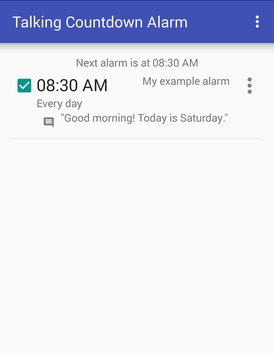
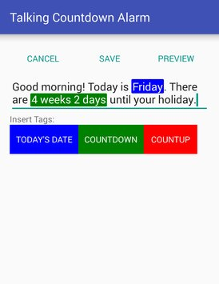

# Talking countdown alarm

An android app that uses text-to-speech to provide an alarm with a spoken daily countdown.

I made and released this app to the Google Play app store in 2016.

The app is no longer available on Google Play, so I'm releasing it as open source.

## Screenshots
 
